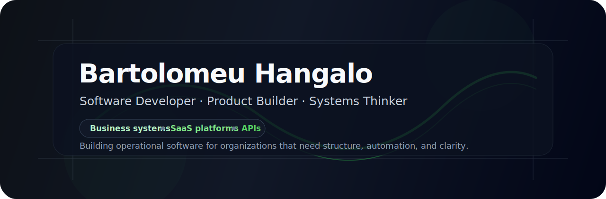

  

  <strong>Building business systems, SaaS platforms, and operational software.</strong>

  Software engineer and product builder based in Luanda, Angola. I design practical systems for organizations that need structure, automation, reliable data, and scalable operations.

---

## What I Build

I build software products that turn fragmented manual processes into structured digital systems.

| Area | Focus |
| --- | --- |
| Business systems | Internal platforms, administrative workflows, reporting, and operational control |
| SaaS platforms | Multi-tenant products, RBAC, dashboards, onboarding flows, and subscription-ready foundations |
| Backend platforms | APIs, domain models, integrations, database design, and service boundaries |
| Product engineering | Turning business requirements into usable software with clear technical trade-offs |
| Digital operations | Automation, decision support, data organization, and process visibility |

## Core Stack

  
  
  
  
  
  
  
  
  
  
  
  
  
  
  

**Frontend:** TypeScript, React, Next.js, Tailwind CSS  
**Backend:** Java, Kotlin, Spring Boot, Node.js, NestJS, Python, FastAPI  
**Databases:** PostgreSQL, Supabase, Prisma  
**Infrastructure:** Docker, GitHub Actions, Vercel, Railway, Render, Linux  
**Architecture:** APIs, RBAC, multi-tenant systems, operational workflows, domain-driven data models

## GitHub Activity

  

Total contributions are based on the GitHub contribution graph and include private contribution counts when they are visible on the profile.

## Engineering Focus

- Software architecture that remains understandable as products grow
- Backend systems with clear data models, boundaries, and access control
- Multi-tenant platforms for real organizations and operational teams
- Product engineering that connects technical decisions with business outcomes
- Internal tools that replace fragmented manual processes with structured systems
- AI-assisted development workflows with review, iteration, and controlled integration

## Current Product Directions

| Product direction | Scope |
| --- | --- |
| Flash Academy | Multi-tenant SaaS for training centers, course operations, student onboarding, and institutional management |
| Persistech 360 | Organizational evaluation platform focused on structured performance feedback and controlled access |
| Argon / Einstein | Education-oriented software direction with backend-first architecture and product iteration |
| Business automation | Practical systems for companies that need better workflows, reporting, and operational visibility |

## Public Work

Some commercial product repositories are private by design. Public materials are used to present product direction, architecture, and technical reasoning without exposing proprietary implementation details.

This profile is intentionally not a catalog of every experiment. It is a public overview of the kind of software I build and the engineering direction behind it.

## Background

I study and build software with a focus on practical systems rather than isolated code.

My work combines software engineering, product thinking, and business operations. I am especially interested in building software that helps organizations move from fragmented manual processes to structured, reliable digital systems.
